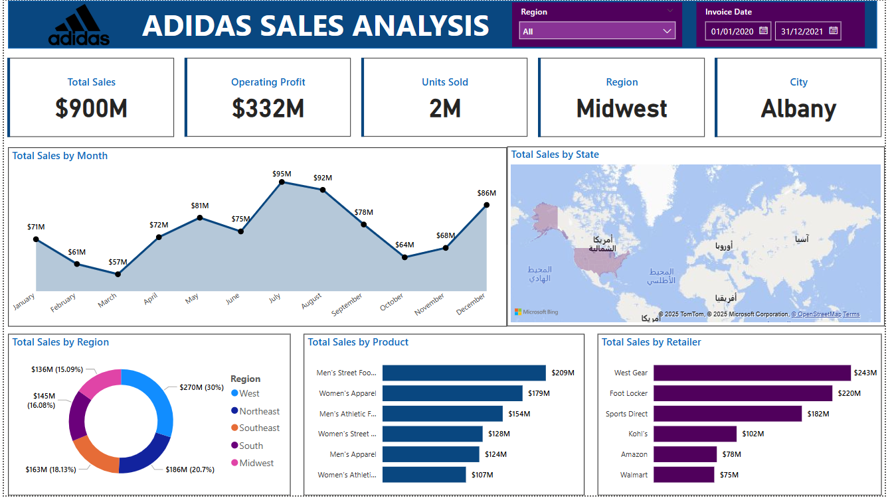

# 📊 Adidas US Sales Analysis Dashboard

A comprehensive Data Analytics project built with **Microsoft Power BI** to analyze Adidas sales performance across the United States. This dashboard provides actionable insights into sales trends, operating profit, and product performance.

## 🖼️ Dashboard Preview

## 🚀 Project Overview
This project simulates a real-world business scenario using a synthetic dataset for Adidas US Sales. The goal is to transform raw data into meaningful visualizations that aid in decision-making.

**Key Objectives:**
* Analyze total sales and operating profit by region and retailer.
* Track monthly and yearly performance trends.
* Compare product categories (Men's vs Women's, Footwear vs Apparel).
* Identify high-performing sales methods (Online vs In-store).

## 🛠️ Tools & Technologies
* **Microsoft Power BI:** For data visualization and interactive reporting.
* **Power Query (M Language):** For ETL (Extract, Transform, Load) and data cleaning.
* **DAX (Data Analysis Expressions):** For complex calculations, measures, and calculated columns.
* **Excel/CSV:** Source data management.

## 🧠 Technical Highlights
This repository demonstrates deep technical understanding of Power BI capabilities:

### 1. Data Transformation (ETL)
* Handling missing values and data types.
* Creating specific Date Tables for time-intelligence analysis.

### 2. Advanced DAX
I have implemented various DAX techniques separated into specific modules (check the `DAX_Breakdown` folder):
* **Measures:** Calculated dynamic aggregations for `Total Sales`, `Total Profit`, and `Profit Margin`.
* **Calculated Columns:** Created categorical segments based on sales volume.
* **Calculated Tables:** Generated summary tables for high-level analysis.

---

## 👨‍💻 Author
**Abdallah Salah ELsheikh** - Data Analyst & Software Engineer
